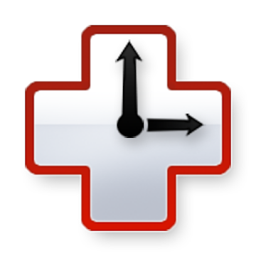
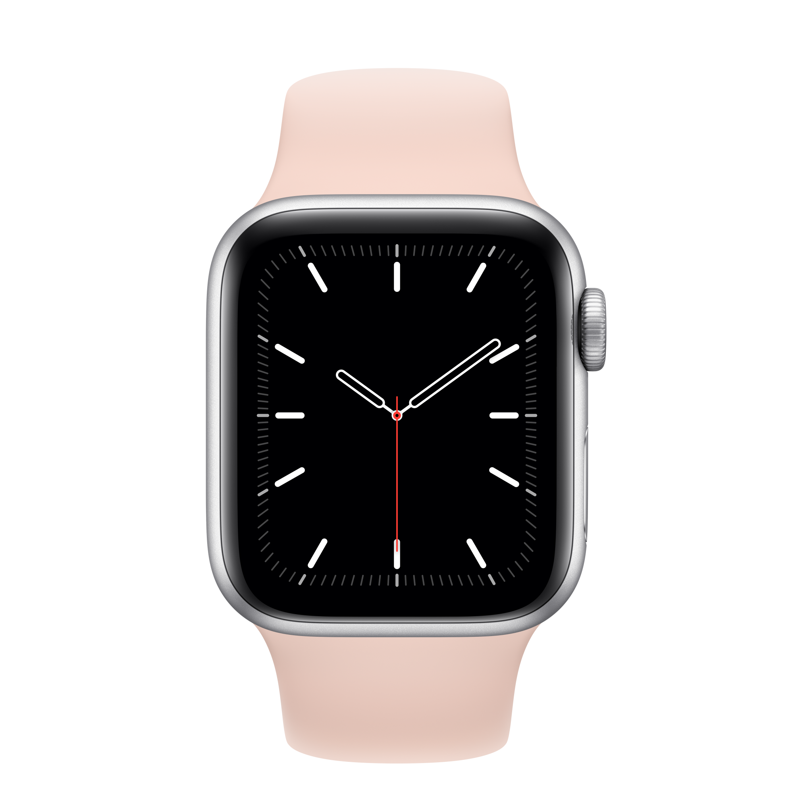
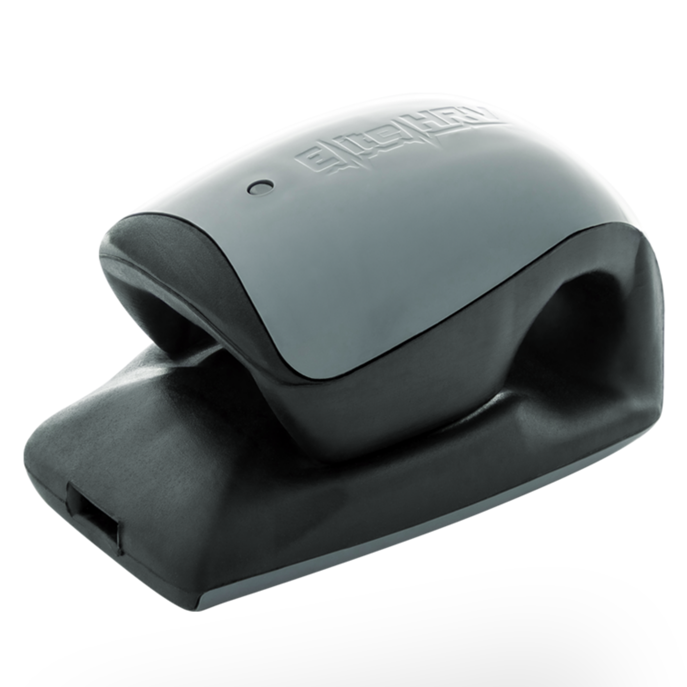
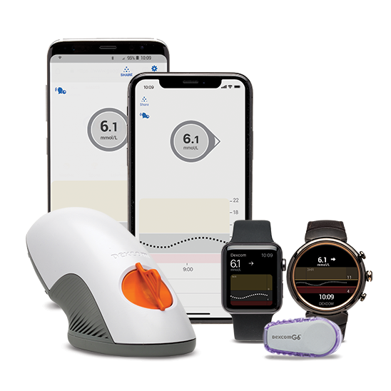
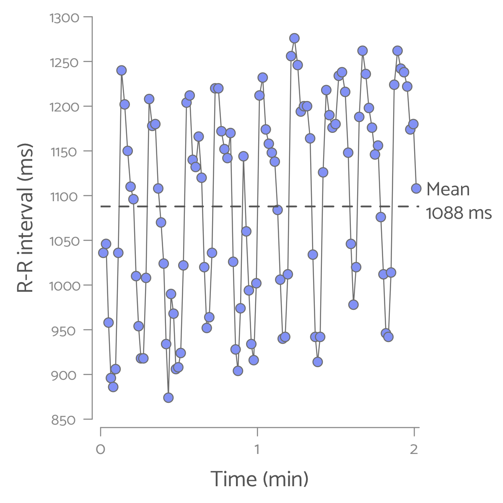

```{r metathis, echo=FALSE}
library(metathis)
meta() %>%
  meta_name("github-repo" = "IreneVDB/RMedicine2021") %>% 
  meta_social(
    title = "You R What You Measure: Digital biomarkers for insights in personalized health",
    url = "https://irenevdb.github.io/RMedicine2021",
    image = "https://irenevdb.github.io/RMedicine2021/YouRWhatYouMeasure_title.png",
    image_alt = paste(
      "Title slide of You R What You Measure:", 
      "Digital biomarkers for insights in personalized health", 
      "presented at R/Medicine 2021 by Irene van den Broek"
    ),
    og_type = "website",
    og_author = "Irene van den Broek",
    twitter_card_type = "summary_large_image",
    twitter_creator = "@JeBentWatJeMeet"
  )

```

```{r setup, include=FALSE}
options(htmltools.dir.version = FALSE)
library(knitr)
knitr::opts_chunk$set(
  fig.retina = 3,
  warning = FALSE, 
  message = FALSE)

library(tidyverse)
library(lubridate)
library(pins)

library(extrafont)
library(extrafontdb) 

library(fontawesome)
library(xaringanExtra)

xaringanExtra::use_panelset()
xaringanExtra::use_share_again()
xaringanExtra::use_tile_view()
loadfonts() 

presentation_date <- format(as.Date("2021-08-27"), format="%B %d")
oura <- pin_get("oura")

```

```{r xaringan-themer, include=FALSE, warning=FALSE}
library(xaringanthemer)
style_mono_accent(
  base_color = "#586CC4",
  link_color = "#FC1CAC",
  inverse_link_color = "white")
```

class: title-slide, inverse, right, top
background-image: url(img/logo_transparent.png)
background-position: 5% 12%
background-size: 15%, cover

<br>
.right[
# `r rmarkdown::metadata$title`
### `r rmarkdown::metadata$subtitle`
]
<br> <br> <br> <br> 
.left[`r rmarkdown::metadata$author` | R/Medicine 2021 | `r presentation_date`]
<hr>

.left[.footnote[[`r fa(name = "link")`  www.jebentwatjemeet.nl](https://www.jebentwatjemeet.nl) <br>
[`r fa(name = "envelope", fill = "white")` irenevandenbroek@gmail.com](mailto:irenevandenbroek@gmail.com)<br><br>
[`r fa(name = "linkedin") ` @IrenevdBroek](https://www.linkedin.com/in/irenevdbroek/)<br>
[`r fa(name = "twitter") ` @JeBentWatJeMeet](http://twitter.com/JeBentWatJeMeet)<br>
[`r fa(name = "github", fill = "white")`  @IreneVDB](http://github.com/IreneVDB)
]]

---
layout:true

<div class="my-footer">
<span style="width:100%; text-align:center"> 
| `r fa(name = "link")`
<a href=https://www.jebentwatjemeet.nl style="color: white"> 
  jebentwatjemeet.nl </a>| `r fa(name = "github")` 
<a href=http://github.com/IreneVDB style="color: white"> 
  @IreneVDB  </a>| `r fa(name = "twitter") `
<a href=http://twitter.com/JeBentWatJeMeet style="color: white"> 
  @JeBentWatJeMeet  </a>|
</span>
</div> 

---
name: intro
class: top

## You are what you measure: My Quantified Self Project
<br>
.pull-left[.center[]]

.pull-right[.center[Collecting data about my .darkpink.large[Health] and .darkpink.large[Habits] using apps, sensors and wearable devices]]

---
name: apps

## Wearables and apps for tracking .darkpurple[Health] and .darkpurple[Habits]

.left-col[ Oura Ring
<br><br>
 RescueTime
<br><br>
 Strava]

.center-col[ HRV4Training
<br><br>
 Dreem
<br><br>
 FreeStyle Libre]

.right-col[ Apple Watch
<br><br>
 CorSense
<br><br>
 Cronometer]

---
name: aim
class: center

## .left[Let's talk biomarkers. Let's talk health tech. Let's talk R!]

<br>
.pull-left[`r fa("mobile-alt", fill="#586CC4", height = "7em", margin_left="1em", margin_right="1em")` `r fa("heartbeat", fill="#586CC4", height = "7em", margin_left="1em", margin_right="1em")`
<br>
<br>
.xlarge[The potential of digital biomarkers to advance personalized health]
<br><br>
Personal use <br> Clinical trials <br> Clinical practice]

.pull-right[`r fa("r-project", fill="#586CC4", height = "7em", margin_left="1em", margin_right="1em")`
<br>
<br>
.xlarge[The power of R to support digital health data] 
<br><br>
Data collection <br> Data analysis <br> Data communication]

---
name: Digital Biomarkers
class: left

## Digital Biomarkers

** Digital Biomarkers**: _Objective, quantifiable physiological and behavioral data that are collected and measured by means of digital devices such as apps, sensors and wearables._

<br>
.center[]

---

## Blood Glucose Monitoring in Diabetes Management

<div style="vertical-align:middle; display:inline-block; text-align:center; width:30%;">
 
</div>
`r fa("arrow-right", height="2em")`
<div style="vertical-align:middle; display:inline-block; text-align:center; width:30%;">
 
</div>
`r fa("arrow-right", height="2em")`
<div style="vertical-align:middle; display:inline-block; text-align:center; width:30%;">

</div>

<br>
<hr>
<br>

<div style="vertical-align:top; display:inline-block; text-align:center; width:24%;">
    
    <span style="display:block;">Dexcom</span>
</div>

<div style="vertical-align:top; display:inline-block; text-align:center; width:24%;">
    
    <span style="display:block;">Eversense</span>
</div>

<div style="vertical-align:top; display:inline-block; text-align:center; width:24%;">
    
    <span style="display:block;">FreeStyle Libre</span>
</div>

<div style="vertical-align:top; display:inline-block; text-align:center; width:24%;">
    
    <span style="display:block;">Medtronic</span>
</div>

---
name: R-R intervals
class: left

## Heart Rate Variability: a non-invasive marker of .darkpurple[Stress]

**HRV** is the variation in time between consecutive heart beats and reflects the heart's capacity to adapt to changes

<br>
.center[]

---
name: HRV applications
class: center

## .left[Daily HRV measurement to monitor .darkpurple[Stress] and .darkpurple[Recovery]]

.left-column[Using **Corsense** and **HRV4Training** app <br><br>
 <br><br>

]

.right-column[
<iframe src="data/eTrend_HRV4T_H250.html" width="100%" height="450" id="igraph" scrolling="no" seamless="seamless" frameBorder="0"> </iframe>
]

---
name: timeseries
class: center

## .left[More .darkpurple[Long-term] Trends: Step Count, Body Weight and Sleep]

.panelset[

.panel[.panel-name[Step Count]

.left-column[
Using **Apple Watch** <br><br>

<br><br>

]

.right-column[
<iframe src="data/eTrend_Steps.html" width="100%" height="400" id="igraph" scrolling="no" seamless="seamless" frameBorder="0"> </iframe>
]

] <!---->

.panel[.panel-name[Body Weight]

.left-column[
Using **QardioBase** smart scale <br><br>

<br><br>

]

.right-column[
<iframe src="data/eTrend_Weight.html" width="100%" height="400" id="igraph" scrolling="no" seamless="seamless" frameBorder="0"> </iframe>
]

] <!---->

.panel[.panel-name[Sleep]

.left-column[
Using **Dreem** headband <br><br>

<br><br>

]

.right-column[
<iframe src="data/eTrend_Sleep.html" width="100%" height="400" id="igraph" scrolling="no" seamless="seamless" frameBorder="0"> </iframe>
]

] <!---->

] <!---->
---
name: Nightly patterns
class: center

## .left[More about .darkpurple[Sleep]: the Easiest way to collect data!]

.panelset[

.panel[.panel-name[Sleep Phases]
.left-column[
Using **Dreem Headband**<br>

<br>

]

.right-column[
```{r Nightly_SleepPhase, echo = FALSE, fig.align="center", fig.dim=c(12, 6.5)}
source("src/Daily_categoric.R")
ggridge.sleep()
```
]
] <!---->

.panel[.panel-name[HRV]

.left-column[
Using **Oura Ring**<br>

<br>

]

.right-column[
```{r oura_HRV, echo = FALSE, fig.dim=c(12, 6.5), fig.align="center"}
source("src/Daily_timeserie.R")

oura_noNA <- oura[["Sleep"]] %>%
  filter(is.na(sleep.period_id) == FALSE)

oura_HRV <- map(1:nrow(oura_noNA), function(row){
  df <- data.frame(datetime = seq(as_datetime(oura_noNA$sleep.bedtime_start[row], tz = "CET"),
                                  as_datetime(oura_noNA$sleep.bedtime_end[row], tz = "CET"), by = "5 mins"),
                   HRV = unlist(oura_noNA$sleep.rmssd_5min[row]))
}) %>%
  bind_rows() %>%
  filter(HRV > 0) %>%
  mutate(datetime = round_date(datetime, unit = "5mins"))

daily.timeserie("Oura Ring", df = oura_HRV, datetime_col ="datetime", value_col = "HRV", var = "HRV", unit = "msec", day_or_night = "night", hue = 0.65, ymin = 40, ymax = 170, starttime = 21, endtime = 8.5)
```
]

] <!---->

.panel[.panel-name[Heart Rate]

.left-column[
Using **Oura Ring**<br>

<br>

]

.right-column[
```{r oura_HR, echo = FALSE, fig.dim=c(12, 6.5), fig.align="center"}
oura_HR <- map(1:nrow(oura_noNA), function(row){
  df <- data.frame(datetime = seq(as_datetime(oura_noNA$sleep.bedtime_start[row], tz = "CET"),
                                  as_datetime(oura_noNA$sleep.bedtime_end[row], tz = "CET"), by = "5 mins"),
                   HR = unlist(oura_noNA$sleep.hr_5min[row]))
}) %>%
  bind_rows() %>%
  filter(HR > 0) %>%
  mutate(datetime = round_date(datetime, unit = "5mins"))

daily.timeserie("Oura Ring", df = oura_HR, datetime_col ="datetime", value_col = "HR", var = "Heart Rate", unit = "BPM", day_or_night = "night", hue = 0.45, ymin = 40, ymax = 66, starttime = 21, endtime = 8.5)
```
]

] <!---->

] <!---->

---
name: Biological Clock
class: center

## .left[Daily Rhythms and the .darkpurple[Biological Clock]]

.panelset.sideways[

.panel[.panel-name[Sleep]

```{r ggridge_sleep, echo=FALSE, fig.dim=c(12, 7.5), fig.align="center", dev.args = list(bg = 'transparent')}
source("src/ggridge_dow.R")
load("data/Sleep_Times.RData")

make.ggridge.time(tracker = "Dreem", df = Sleep_Times,
                  time_columns = c("Sleep Start","Wake Up"),
                  timescale = "night", duration_column = NULL, group = NULL,
                  base_hue = 0.75, hue_range= 0.45,
                  title_key = "Sleep")
```

] <!---->

.panel[.panel-name[Meals]

```{r ggridge_meal, echo=FALSE, fig.dim=c(12,7.5), fig.align="center", dev.args = list(bg = 'transparent')}
source("src/ggridge_dow.R")
load("data/Meal_Times.RData")

make.ggridge.time(tracker = "Cronometer",
                  df = Meal_Times,
                  time_columns = c("Breakfast", "Lunch", "Dinner"),
                  timescale = "day", duration_column = NULL, group = NULL,
                  base_hue = 0.55, hue_range = 0.45,
                  title_key = "Meal")
```

] <!---->

.panel[.panel-name[Excercise]

```{r ggridge_exercise, echo=FALSE, fig.dim=c(12,7.5), dev.args = list(bg = 'transparent')}
source("src/ggridge_dow.R")
load("data/Strava.RData")

make.ggridge.time(tracker = "Strava", df = Strava, time_columns = "start_date_local", duration_column = "Duration_min", group= "Type",
                  title_key = "Exercise",base_hue = 0.55, hue_range = 0.5, add_poly = FALSE)
```

] <!---->

] <!---->

---
name: Productivity
class: center

## .left[Tracking .darkpurple[Productivity] and .darkpurple[Screen Time]]

.left-column[
Using **RescueTime**<br>

]

.right-column[

]

---
name: Female Cycle
class: left

## .darkpurple[Montly Rhythms] and Hormonal Influences

.panelset.sideways[

.panel[.panel-name[Body Temperature]

```{r bodyTemp_cycle, echo=FALSE, fig.align = "center", fig.dim=c(13,8), dev.args = list(bg = 'transparent')}
source("src/cyclical.R")
load("data/period.RData")

make.menstrual.heatmap(tracker = "Oura Ring", df = oura[["Sleep"]],
                      column = sleep.temperature_deviation,
                      lab = "Body Temperature", type = "value",
                      title = "Body Temperature during Sleep along the Female Cycle",
                      hue = 0.55)
```
] <!---->

.panel[.panel-name[Breathing]

```{r breathing_cycle, echo=FALSE, fig.align = "center", fig.dim=c(13,8), dev.args = list(bg = 'transparent')}
make.menstrual.heatmap(tracker = "Oura Ring", df = oura[["Sleep"]],
                      column = sleep.breath_average,
                      lab = "Respiration Rate", type = "value",
                      title = "Respiration Rate during Sleep along the Female Cycle",
                      hue = 0.47)
```
] <!---->

.panel[.panel-name[Headaches]

```{r Headache_cycle, echo=FALSE, fig.align = "center", fig.dim=c(13,8), dev.args = list(bg = 'transparent')}

load("/Users/irenevandenbroek/Documents/R-Projects/Projects/QuantifiedSelf/Mood/Mood.RData")

Mood <- Mood %>%
  mutate(Headache = factor(case_when(Headache == "0" ~ "None",
                                    Headache == "1" ~ "Mild",
                                    Headache == "2" ~ "Moderate",
                                    Headache == "3" ~ "Severe",
                                    TRUE ~ "No data"),
                          levels = c("None", "Mild", "Moderate", "Severe", "No data")))

make.menstrual.heatmap(tracker = "TracknShare", df = Mood,
                       column = Headache, lab = "Headache",
                       type = "value",
                       title = "Headache occurence along the Female Cycle",
                       hue = 0.51)
```

] <!---->
] <!---->

---
name: Conclusion
class: left

## In Conclusion...You R What You Measure!


.Footnote[Future (R-) Goals:
- **Automate** and **Share** data upload, analysis and visualization 
- Work together on **Digital Health** Data (Viz) Projects ([*Get in touch!*](mailto:irenevandenbroek@gmail.com))]

---
name: Resources
class: left

## Resources

**Blood Sugar Monitoring** for personalized nutrition:<br>
[The Personalized Nutrition Project](http://personalnutrition.org/Home)

<hr>

**Heart Rate Variability:** <br>
`r emo::ji("package")` {[RHRV](https://rhrv.r-forge.r-project.org/index.html)} <br>
[EliteHRV](https://elitehrv.com) blog <br>
[HRV4Training](https://www.hrv4training.com/blog) blog

<hr>

**Data Visualization** R packages: <br>
`r emo::ji("package")` {[echarts4r](https://echarts4r.john-coene.com)} <br>
`r emo::ji("package")` {[ggridges](https://cran.r-project.org/web/packages/ggridges/vignettes/introduction.html)} <br>
`r emo::ji("package")` {[ggplot2](https://ggplot2.tidyverse.org)} 

---
name: Bonus slides
class: inverse, center, middle

background-image: url(img/logo_transparent.png)
background-position: 5% 10%
background-size: 10%, cover

<br>
#Bonus slides <br>
(Slides that did not fit in the 10 min talk)

<div class="my-footer"></div>

---
name: HRV Recommendations
class: center

## .left[Be aware *how* Heart Rate Variability is .darkpurple[Measured]...]

```{r HRV_table, echo=FALSE}
source("src/gt_layout.R")

HRV_table <- data.frame(
  "Sensor" = c("Electric (chest strap)", "Optic (wrist, arm, finger, ear)"),
  "Time" = c("First thing upon awakening", "Fixed time of day"),
  "Length" = c("5 min", "> 1 min"),
  "Position" = c("Supine / Laying", "Sitting"),
  "Breathing" = c("Natural", "Paced"),
  "Frequency" = c("Every day", "At least 3x per week")) %>%
  magrittr::set_rownames(c("Optimal", "Alternative")) %>%
  t() %>%
  as.data.frame() %>%
  gt(rownames_to_stub = TRUE) %>%
  tab_header(title = "Recommendations for short-term HRV readings") %>%
  set.table.layout()

HRV_table
```

---
name: HRV Analysis 
class: center

## .left[...and *how* Heart Rate Variability is .darkpurple[Analysed]...]

<div style="vertical-align:top; display:inline-block; text-align:center; width:33%;">
   
    <span style="display:block;">Time Domain</span>
</div>

<div style="vertical-align:top; display:inline-block; text-align:center; width:33%;">
   
    <span style="display:block;">Frequency Domain</span>
</div>

<div style="vertical-align:top; display:inline-block; text-align:center; width:33%;">
   
    <span style="display:block;">Non-Linear Analysis</span>
</div>

---
name: HRV Long-term
class: top left

## .left[Another application of HRV: .darkpurple[Long-term] measurements]

.left-column[.center[HRV for **Biofeedback** or **Sport Performance** <br><br>   <br> Polar H10 <br><br>  <br> HRV Logger app
]]

.right-column[
```{r HRV_longterm, echo = FALSE, fig.align = "center", fig.dim = c(12, 6.5)}
HRVLogger <- pin_get("HRVLogger")
source("src/HRV_longterm.R")
par(mfrow = c(2, 1), oma = c(0,0,0,0))
make.plot.HRV_sport()
make.plot.HRV.Breath()
```
]

---
name: api
class: center

## .left[How to get the Data? All Ways lead to R...!]

.panelset[

.panel[.panel-name[Manual vs Magical]

<br><br>

.pull-left[`r fa("file-export", fill="#586CC4", height = "5em", margin_left="1em", margin_right="1em")` `r fa("file-import", fill="#586CC4", height = "5em", margin_left="1em", margin_right="1em")`
<br>

.xlarge[MANUAL] <br> Export + Import Files <br>]

.pull-right[`r fa("cloud-download-alt", fill="#586CC4", height = "5em", margin_left="1em", margin_right="1em")``r fa("magic", fill="#586CC4", height = "5em", margin_left="1em", margin_right="1em")`
<br>

.xlarge[MAGICAL] <br> Cloud + API <br>

]

] <!---->

.panel[.panel-name[Example Oura API]
```{r Oura_api, eval = FALSE}
connect.api <- function(startdate, token, username, password, data_type){
    url <- paste0("https://api.ouraring.com/v1/", data_type, "?start=",
                  startdate, "&access_token=", token)
    get_data <- GET(url, authenticate(username, password, type = "basic"))
    content <- content(get_data, "text")
    json <- fromJSON(content, flatten = TRUE)
    df <- as.data.frame(json)
}
```

```{r Oura_get, eval = FALSE}
oura <- map(c("sleep", "activity", "readiness"), connect.api, startdate = "2020-01-29",
            token = key_get("Token", keyring= "oura"),
            username = key_get("Username", keyring="oura"),
            password = key_get("Password", keyring= "oura"))
```
<hr>
.left[`r emo::ji("package")` {httr} : Connect <br>
`r emo::ji("package")` {keyring}: Store credentials <br>
Or look for dedicated packages: e.g., `r emo::ji("package")` {rStrava}]
] <!---->

] <!---->

---
name: Daily patterns
class: center

## .left[Insights from Time Series: .darkpurple[Daily Patterns]]

.panelset[

.panel[.panel-name[Blood Sugar]

.left-column[
Using **Free Style Libre** Sensor <br>

<br>

]

.right-column[
```{r FSL_glucose, echo = FALSE, fig.align="center", fig.dim=c(12, 6.5)}
source("src/Daily_timeserie.R")
load("data/FSL.RData")

daily.timeserie("FreeStyle Libre", df = FSL, datetime_col ="timestamp", value_col = "Glucose", var = "Glucose", unit = "mmol/L", day_or_night = "day", hue = 0.55, ymin = 0, ymax = 9, starttime = 0, endtime = 24)

```
]
] <!---->

.panel[.panel-name[Activity]

.left-column[
Using **Oura Ring**<br>

<br>

]

.right-column[
```{r Daily_Activity, echo = FALSE, fig.align="center", fig.dim=c(12, 6.5)}
source("src/Daily_categoric.R")
oura <- pin_get("oura")
ggridge.activity()
```
]

] <!---->

] <!---->
